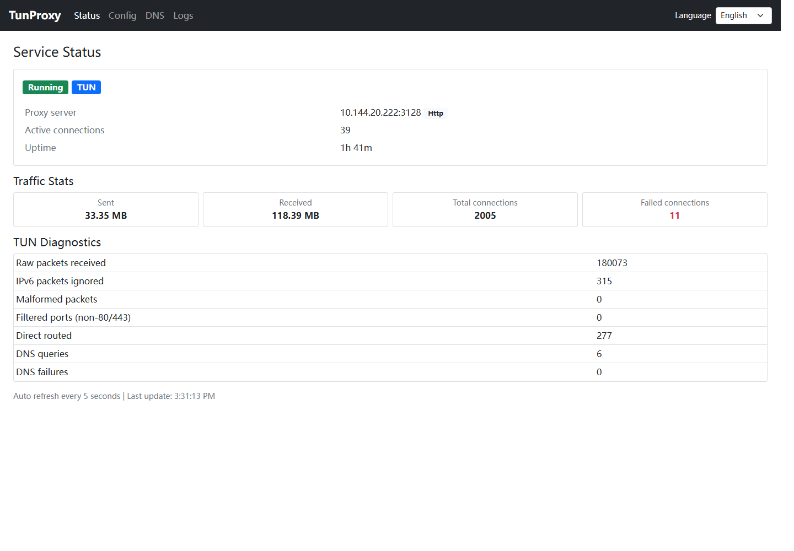
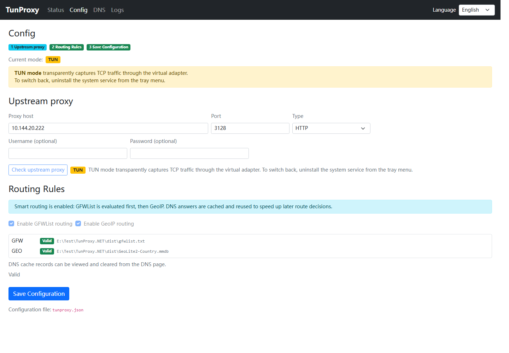
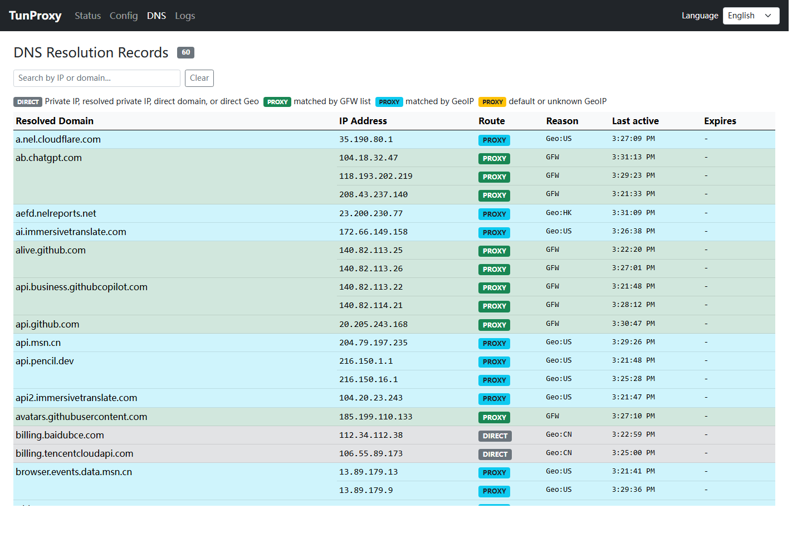
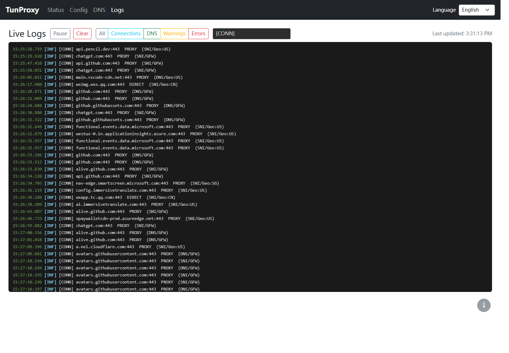

# TunProxy.NET

[中文](README.md)

TunProxy.NET is a .NET 8 proxy tool with both local proxy mode and TUN transparent proxy mode. It forwards system or application traffic to an upstream SOCKS5/HTTP proxy, then applies smart routing with GFWList, GeoIP, DNS caching, and direct-route bypass rules.

The current system is more than a command-line proxy. It includes a tray-managed service lifecycle, a Web console for configuration and diagnostics, and hard startup checks so TUN mode only starts when required routing resources are actually usable.

## Screenshots

The Web console is available at `http://localhost:50000/` by default.









## Features

- Local proxy mode: listens on a local port and can automatically configure the Windows system proxy.
- TUN mode: transparently captures TCP traffic through a Wintun virtual adapter, with automatic TUN address, route, and DNS forwarding setup.
- Upstream proxy support: SOCKS5, HTTP CONNECT, and optional username/password authentication.
- Smart routing: GFWList first, then GeoIP; private addresses and direct-bypass addresses use the original gateway.
- DNS cache: TUN mode caches A records, can answer safe cache hits directly, and exposes records for search and cleanup in the DNS page.
- Rule resource validation: GeoIP must be loadable by MaxMind, and GFWList must be parseable; missing or invalid resources block direct TUN startup.
- Web console: status, configuration, DNS records, direct IPs, live logs, PAC preview, and system PAC controls.
- Upstream proxy check: routing configuration is unlocked only after Google, GitHub, and YouTube all return HTTP 200 through the configured proxy.
- Save and restart flow: configuration is written to `tunproxy.json`, then a `tunproxy.restart` marker asks the tray app to restart the service after the old process has stopped.
- Windows tray app: start/stop service, install/uninstall Windows service, open console, and repair TUN mode mismatch.
- Logs and metrics: console logs, rolling file logs, in-memory log API, connection counters, DNS counters, TUN packet counters, failures, and throughput.

## Running

### Recommended: tray app

Publish to `dist`, then run the tray app:

```powershell
.\publish.bat
.\dist\TunProxy.Tray.exe
```

The tray app polls `http://localhost:50000/api/status` and handles:

- Starting or stopping `TunProxy.CLI.exe`.
- Installing or uninstalling the `TunProxyService` Windows service.
- Waiting for the old service to stop before starting it again when the Web console requests a restart.
- Applying the system proxy in local proxy mode and disabling it in TUN mode.

### Development run

```powershell
dotnet run --project src\TunProxy.CLI\TunProxy.CLI.csproj -- --proxy 127.0.0.1:7890 --type socks5
```

Common arguments:

```powershell
--proxy, -p      Upstream proxy endpoint, for example 127.0.0.1:7890
--type, -t       Upstream proxy type: socks5 or http
--username, -u   Upstream proxy username
--password, -w   Upstream proxy password
--install        Install the Windows service and set tun.enabled to true
--uninstall      Uninstall the Windows service and set tun.enabled to false
```

After startup, open:

```text
http://localhost:50000/
```

## Modes

### Local Proxy Mode

When `tun.enabled = false`, TunProxy starts in local proxy mode. It listens on `localProxy.listenPort` and can set the Windows system proxy to that local endpoint. This mode does not require administrator privileges and is useful for setting up the upstream proxy, downloading GeoIP/GFWList resources, and configuring PAC.

### TUN Mode

When `tun.enabled = true`, TunProxy starts in TUN mode. On Windows this requires administrator privileges or the Windows service. The app creates a Wintun adapter, configures the TUN address, default route, upstream proxy bypass route, and DNS forwarding.

If GeoIP or GFWList is enabled but the resource is missing or invalid, TunProxy starts in Local Proxy setup mode first. Prepare or repair the resources from the Web console, then save the configuration and restart into TUN mode.

## Configuration

The configuration file is `tunproxy.json` in the application directory. The Web console updates this file when saving configuration.

```json
{
  "proxy": {
    "host": "127.0.0.1",
    "port": 7890,
    "type": "Socks5",
    "username": null,
    "password": null
  },
  "tun": {
    "enabled": false,
    "ipAddress": "10.0.0.1",
    "subnetMask": "255.255.255.0",
    "addDefaultRoute": true,
    "dnsServer": "8.8.8.8"
  },
  "localProxy": {
    "listenPort": 8080,
    "setSystemProxy": true,
    "bypassList": "<local>;localhost;127.0.0.1;10.*;192.168.*",
    "systemProxyBackup": {
      "captured": false,
      "proxyEnable": 0,
      "proxyServer": null,
      "proxyOverride": null,
      "autoConfigUrl": null
    }
  },
  "route": {
    "mode": "smart",
    "proxyDomains": [],
    "directDomains": [],
    "enableGeo": true,
    "geoProxy": [],
    "geoDirect": [],
    "geoIpDbPath": "GeoLite2-Country.mmdb",
    "enableGfwList": true,
    "gfwListUrl": "https://raw.githubusercontent.com/gfwlist/gfwlist/master/gfwlist.txt",
    "gfwListPath": "gfwlist.txt",
    "tunRouteMode": "global",
    "tunRouteApps": [],
    "autoAddDefaultRoute": true
  },
  "logging": {
    "minimumLevel": "Information",
    "filePath": "logs/tunproxy-.log"
  }
}
```

## Routing

Smart routing roughly follows this order:

1. If the domain matches GFWList, use the proxy.
2. If the destination IP is private, go direct.
3. If there is a domain but no destination IP, resolve and cache it.
4. If GeoIP is enabled, evaluate `geoDirect` and `geoProxy`.
5. If no rule matches or the address cannot be identified, use the proxy by default.

The policy favors reachability and safety: unknown addresses default to proxy, while private addresses default to direct.

## Web Console

Main pages:

- `Status`: runtime state, proxy details, connection counts, throughput, and TUN diagnostics.
- `Config`: upstream proxy, smart routing, GeoIP/GFWList resources, save-and-restart, and PAC controls.
- `DNS`: TUN DNS records, route reasons, DNS cache state, and direct IP list.
- `Logs`: live in-memory logs with pause, clear, scroll-to-bottom, and filters for connection/DNS/warning/error lines.

Main APIs:

```text
GET    /api/status
GET    /api/config
POST   /api/config
POST   /api/restart
POST   /api/upstream-proxy/check
GET    /api/rule-resources/status
POST   /api/rule-resources/prepare
POST   /api/rule-resources/download
GET    /api/dns-records
DELETE /api/dns-cache?ip=...
GET    /api/direct-ips
GET    /api/logs
GET    /proxy.pac
POST   /api/set-pac
POST   /api/clear-pac
```

## Build and Test

```powershell
dotnet build src\TunProxy.CLI\TunProxy.CLI.csproj -v minimal
dotnet build src\TunProxy.Tray\TunProxy.Tray.csproj -v minimal
dotnet test tests\TunProxy.Tests\TunProxy.Tests.csproj -v minimal
```

Local publish:

```powershell
.\publish.bat
```

`publish.bat` publishes Windows x64 self-contained single-file binaries to `dist` and copies `wintun.dll`.

## Project Layout

```text
TunProxy.NET/
├─ src/
│  ├─ TunProxy.Core/       Core config, packet parsing, connection management, Wintun abstractions
│  ├─ TunProxy.CLI/        Web console, API, local proxy, TUN service, routing, DNS
│  ├─ TunProxy.Tray/       Windows tray and service lifecycle management
│  └─ TunProxy.Tray.macOS/ Experimental macOS tray project
├─ tests/TunProxy.Tests/   xUnit tests
├─ docs/images/            README screenshots
├─ publish.bat             Local Windows publish script
└─ TunProxy.NET.sln
```

## FAQ

### Why does saving configuration restart the service?

The upstream proxy, TUN adapter, route service, and DNS service all hold runtime state such as sockets, routes, and listeners. Saving configuration only writes `tunproxy.json`; applying it requires a restart. The Web console writes `tunproxy.restart`, and the tray app starts the service only after the old process has stopped, avoiding port and route races.

### Why did TUN not start directly?

When GeoIP or GFWList is enabled, TunProxy checks that the corresponding files are actually valid. A file that merely exists is not enough. Prepare the resources from the Config page, then save and restart.

### Why is the DNS page empty?

DNS records are only available in TUN mode. In local proxy mode, browsers hand hostnames directly to the local/upstream proxy, so TUN DNS interception is not needed.

### When are administrator privileges required?

Local proxy mode does not require administrator privileges. TUN mode creates a virtual adapter and changes system routes, so on Windows you should install the service from the tray app or run the CLI as administrator.

## License

MIT
